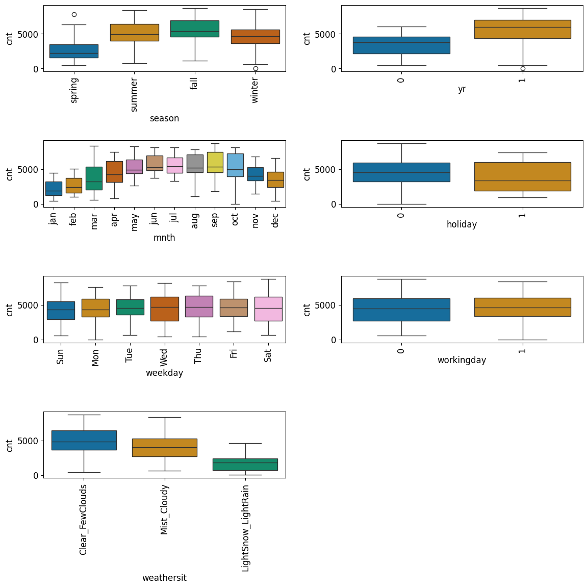
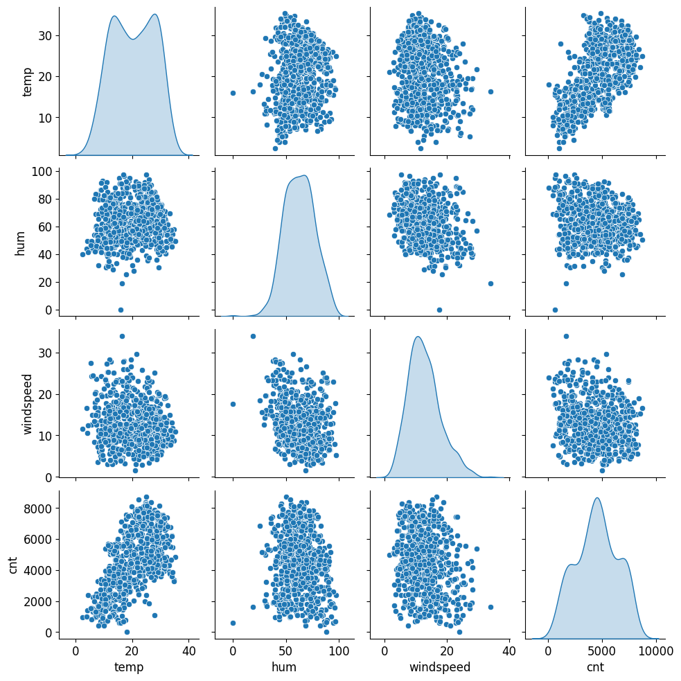
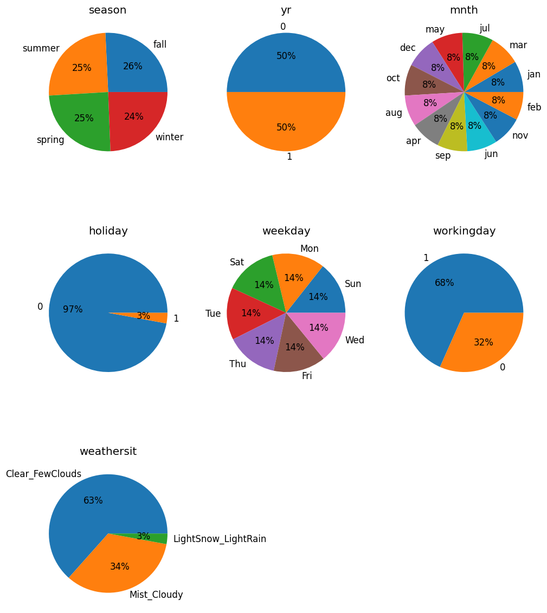
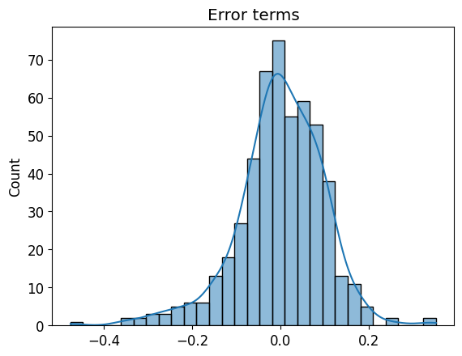
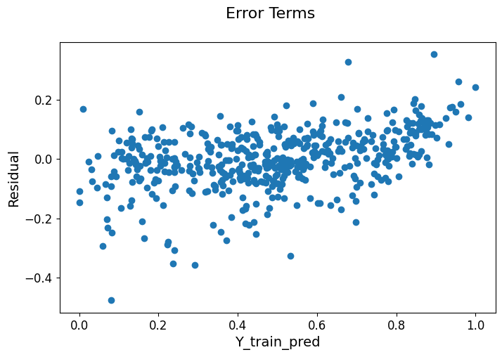
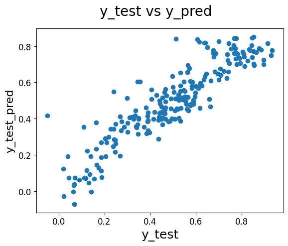

# Bike Sharing 
> Bike Sharing Project details: BoomBikes, a US bike-sharing provider, is struggling with reduced revenues due to the COVID-19 pandemic and >seeks to develop a business plan to boost revenue post-pandemic. To prepare for a surge in demand once the lockdown ends, BoomBikes wants >to analyze factors influencing bike demand in the American market. They have hired a consulting company to determine:

> * Significant variables predicting bike demand.
> * How well these variables explain bike demand.

>The company has collected a large dataset on daily bike usage, incorporating various factors from meteorological surveys and consumer >behaviors. This analysis aims to optimize BoomBikes' strategy and stand out in the competitive market once the economy recovers.

## Table of Contents
* [General Info](#general-information)
* [Technologies Used](#technologies-used)
* [Conclusions](#conclusions)
* [Acknowledgements](#acknowledgements)

<!-- You can include any other section that is pertinent to your problem -->

## General Information
### Project Information
- This project is a data science project. It uses Bike data set to predict whether a user will register for bike sharing or not.
### Project Background
A bike-sharing system is a service in which bikes are made available for shared use to individuals on a short term basis for a price or free. Many bike share systems allow people to borrow a bike from a "dock" which is usually computer-controlled wherein the user enters the payment information, and the system unlocks it. This bike can then be returned to another dock belonging to the same system.

A US bike-sharing provider BoomBikes has recently suffered considerable dips in their revenues due to the ongoing Corona pandemic. The company is finding it very difficult to sustain in the current market scenario. So, it has decided to come up with a mindful business plan to be able to accelerate its revenue as soon as the ongoing lockdown comes to an end, and the economy restores to a healthy state. 

In such an attempt, BoomBikes aspires to understand the demand for shared bikes among the people after this ongoing quarantine situation ends across the nation due to Covid-19. They have planned this to prepare themselves to cater to the people's needs once the situation gets better all around and stand out from other service providers and make huge profits.

They have contracted a consulting company to understand the factors on which the demand for these shared bikes depends. Specifically, they want to understand the factors affecting the demand for these shared bikes in the American market. The company wants to know:

Which variables are significant in predicting the demand for shared bikes.
How well those variables describe the bike demands
Based on various meteorological surveys and people's styles, the service provider firm has gathered a large dataset on daily bike demands across the American market based on some factors. 

### Business Problem to solve
-  To model the demand for shared bikes with the available independent variables. It will be used by the management to understand how exactly the demands vary with different features. They can accordingly manipulate the business strategy to meet the demand levels and meet the customer's expectations. Further, the model will be a good way for management to understand the demand dynamics of a new market. 
  
### Project dataset
- The dataset is a csv file with name: day.csv. It is added in the repo.

## Conclusions
- By using the above scatter plot and the table , We can see that the equation of our best fitted line is:

  cnt = 0.251 × yr - 0.090 * holiday + 0.008 * workingday + 0.583 × temp − 0.150 × windspeed + -0.010 * season_fall + 0.115 × season_Winter + 0.060 x mnth_mar + 0.090 × mnth_apr + 0.033 * mnth_jun + 0.088 * mnth_sep + 0.051 * mnth_oct - 0.081 x weathersit_Mist_Cloudy - 0.268 * weathersit_LightSnow_LightRain  + 0.096

- All the positive coefficients like temp,season_Summer indicate that an increase in these values will lead to an increase in the value of cnt. All the negative coefficients indicate that an increase in these values will lead to a decrease in the value of cnt.
- From R-Sqaured and adj R-Sqaured value of both train and test dataset we could conclude that the above variables can well explain more than 78.5% of bike demand.
- Coeffiencients of the variables explains the factors effecting the bike demand
- Based on final model top three features contributing significantly towards explaining the demand are:
* Temperature : (0.583)
* windspeed : (-0.150)
* year : (0.251)

### Driving factors which can be used to predict about chances of loan default are:
- yr
- holiday
- temp
- windspeed
- season_summer
- season_winter
- mnth_sep
- mnth_oct
- weathersit_Mist_Cloudy
- weathersit_LightSnow_LightRain
  
## Technologies Used
- Numpy - version '2.0.2'
- Pandas - version '2.2.2'
- Seaborn - version '0.13.2'
- Matplotlib - version '3.9.2'
- sklearn - '1.5.1'
- statsmodels - '0.14.4'

## Acknowledgements
- This project was inspired by UpGrad(IIITB) in AI/ML Executive Post Graduate course as a case study
- This project was based on linear regression: ([https://learn.upgrad.com/course/5811/segment/57681/345226/1043364/5213120](https://learn.upgrad.com/course/5811/segment/57681/345226/1043364/5213120)).

## Contact
Created by [@androidev1] -- feel free to contact me!

